# 🌍 EconVerse: Serverless Financial Simulation Engine

**A deterministic, event-driven economic simulation platform built on AWS Free Tier.**

EconVerse simulates a closed-loop economy where macroeconomic states, market orders, agent behaviors, and blockchain consensus evolve in discrete, replayable "ticks." It demonstrates a sophisticated **Distributed State Machine** architecture using serverless primitives.

---

## 🏛️ System Architecture

The system avoids "monolithic game loops" in favor of a serverless, decoupled pipeline orchestrated by **AWS Step Functions**.

```mermaid
graph TD
    subgraph "Orchestration Layer (The Heartbeat)"
        User1((Admin)) -->|Manual Trigger| SFN[Step Functions State Machine]
        Scheduler(EventBridge Scheduler) -.->|Future: 1hr| SFN
    end

    subgraph "Simulation Pipeline (Linear Execution)"
        SFN -->|Step 1| Anchor[λ Anchor Layer]
        SFN -->|Step 2| Macro[λ Macro Layer]
        SFN -->|Step 3| Market[λ Market Layer]
        SFN -->|Step 4| Agent[λ Agent Layer]
        SFN -->|Step 5| Ledger[λ Ledger Layer]
    end

    subgraph "Persistence Layer (Single Table Design)"
        Anchor -->|Write Prices| DDB[(DynamoDB Core)]
        Macro -->|Update Rates| DDB
        Market -->|Match Orders| DDB
        Agent -->|Save Decisions| DDB
        Ledger -->|Mint Block| DDB
    end

    subgraph "Public Access Layer (Observer)"
        User((Public User)) -->|GET /state| API[API Gateway]
        API -->|Invoke| Reader[λ Reader Layer]
        Reader -->|Read Feed| DDB
    end

```



## 📸 Visualization & Proof of Work

### 1. The Execution Graph (AWS Step Functions)

*Visual proof of the serverless orchestration logic in action.*


### 2. Live Market Data (Generated Client-Side)

*Real-time asset tracking generated by `visualize.py` querying the public API.*


---

## 🚀 Key Technical Features

* **Finite State Machine (FSM):** The entire economy advances one "Tick" at a time. If a layer fails, the simulation halts safely, preserving state integrity.
* **Single Table Design (DynamoDB):** Optimized access patterns using `PK` (Partition Key) and `SK` (Sort Key) to store disparate entities (Assets, Blocks, Logs) in a single, cost-effective table.
* **Infrastructure as Code (IaC):** Entire stack defined in Python using **AWS CDK**. No manual console clicking.
* **Cost-Bounded Engineering:** Architected strictly within the AWS Free Tier (Lambda < 400k GB-seconds, DynamoDB < 25 WCUs).
* **Random Walk Volatility:** The `Anchor Layer` implements stochastic drift logic to simulate realistic asset price movement.

---

## 🛠️ Deployment Instructions

### Prerequisites

* AWS CLI (Configured)
* Node.js (for CDK)
* Python 3.9+

### 1. Environment Setup

```bash
# Clone and enter directory
git clone https://github.com/your-username/EconVerse.git
cd EconVerse

# Create Virtual Environment
python -m venv .venv
source .venv/bin/activate  # Windows: .venv\Scripts\activate

# Install Dependencies
pip install -r requirements.txt

```

### 2. Deploy Infrastructure

```bash
# Bootstrap AWS CDK (First time only)
cdk bootstrap

# Deploy Stack
cdk deploy --all

```

---

## 🕹️ Usage & Control

### 1. Run the Simulation (Manual Trigger)

You can manually force the economy to advance by triggering the State Machine.

* Go to **AWS Console** > **Step Functions**.
* Select `EconVerse_Tick_Orchestrator`.
* Click **Start Execution**.

### 2. Access Public API

Your deployment will output an API URL in the CDK logs (e.g., `https://xyz.execute-api.us-east-1.amazonaws.com/`).

* **GET /state:** Returns the latest simulation tick and the last 5 historical entries.

### 3. Generate Visualization

Run the included data science script to visualize the market performance:

```bash
python visualize.py

```

---

## 📂 Project Structure

```text
EconVerse/
├── app/                        # Application Logic (The "Brains")
│   ├── layers/                 # The 5 Simulation Stages
│   │   ├── anchor/             # Ingests/Simulates Real World Data
│   │   ├── macro/              # Calculates Country States (Inflation/Rates)
│   │   ├── market/             # Order Book Matching Engine
│   │   ├── agents/             # AI/Bot Decision Logic
│   │   └── ledger/             # Blockchain Block Minting
│   ├── shared/                 # Database Adapters & Utilities
│   └── __init__.py
├── infra/                      # Infrastructure Definition (The "Body")
│   ├── stacks/
│   │   ├── database_stack.py   # DynamoDB Table
│   │   ├── compute_stack.py    # Lambdas & Step Functions
│   │   └── api_stack.py        # API Gateway & Reader
│   └── __init__.py
├── tests/                      # Unit Tests for Market/Ledger Logic
│   ├── unit/
│   │   ├── test_market.py
│   │   ├── test_ledger.py
│   │   └── test_agents.py
│   └── integration/
├── events/                     # Event Payloads for Testing
│   ├── tick_trigger.json       # Step Functions Input
│   └── manual_shock.json       # Simulation Shock Event
├── app.py                      # CDK App Entry Point
├── cdk.json                    # CDK Configuration
├── visualize.py                # Client-Side Data Visualization
├── requirements.txt            # Python Dependencies
└── README.md                   # This Documentation

```

---

## 🔮 Future Roadmap

* [ ] **Agent AI:** Replace random logic with Reinforcement Learning (RL) models.
* [ ] **Frontend:** React/Next.js dashboard consuming the `/state` API.
* [ ] **Multi-Asset:** Support for Forex pairs and Commodities matching.

---

*Built with ❤️ and Systems Engineering by [Aryan Kapoor]*
